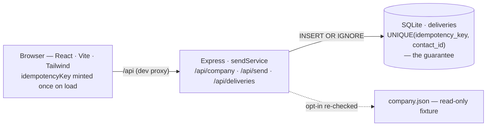
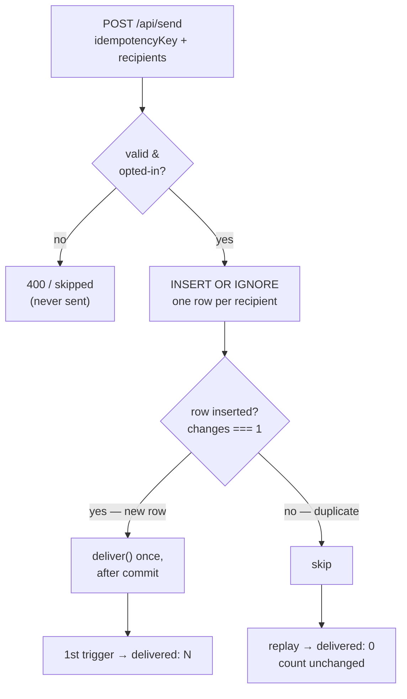

# Compose & Send an Announcement

A small slice of an "announcements" product for a restaurant: write a message, preview it in the
company's own branding, choose the opted-in audience, and send. **Sends are idempotent** —
triggering the same send twice delivers to each recipient *at most once*.

**Live demo:** https://compose-send-announcement.onrender.com
*(free tier — the first load can take ~30–50s while the instance wakes)*

```bash
npm install
npm run dev      # starts the API (:3001) and the web app (:5173) together — open the Vite URL
npm test         # runs the idempotency + opt-out tests
```

> Stack: TypeScript end to end · React + Vite + Tailwind (frontend) · Node + Express (backend) ·
> SQLite via better-sqlite3. No build step in dev; one command runs everything.

**Scope & time.** Built within the ~4-hour cap. I deliberately kept it to one clean slice and spent
the time where judgment shows — making the idempotency guarantee actually hold, and deciding what to
leave out ([section 3](#3-what-i-deliberately-did-not-build-and-why)) — rather than on breadth. AI
handled scaffolding and boilerplate so I could focus there.

---

## Architecture at a glance



### Where to look (fast review)

| If you want to check…                    | Open                                                   | What you'll find |
|------------------------------------------|--------------------------------------------------------|------------------|
| **How idempotency holds**                | [`server/sendService.ts`](server/sendService.ts)       | `INSERT OR IGNORE` → deliver only when `changes === 1`, after commit |
| **The constraint that enforces it**      | [`server/db.ts`](server/db.ts)                         | `UNIQUE (idempotency_key, contact_id)` |
| **Proof it works**                       | [`server/sendService.test.ts`](server/sendService.test.ts) | double-send = N not 2N; opted-out never delivered |
| **Opt-in re-validated server-side**      | [`server/sendService.ts`](server/sendService.ts)       | the partition step — client list is never trusted |
| **The key minted once on load**          | [`src/lib/api.ts`](src/lib/api.ts)                     | `idempotencyKey = crypto.randomUUID()` at module load |
| **The branded preview**                  | [`src/components/Preview.tsx`](src/components/Preview.tsx) | From/To/Subject + body in fixture branding |
| **API routes**                           | [`server/index.ts`](server/index.ts)                   | three thin handlers; logic lives in the service |

---

## 1. What I built

The one path that matters for a first slice:

**Compose → live branded preview → pick recipients → idempotent send.**

- A **preview that renders as a real email** — From / To / Subject metadata over a body styled in
  the company's actual branding (colours, wordmark, fonts) pulled from `company.json`. It updates
  as you type.
- **Consent is first-class**: only the 6 opted-in contacts are selectable; the 4 opted-out are
  shown but excluded, and the server re-checks opt-in on every send regardless of what the UI sends.
- **An idempotent send backed by a database constraint** (section 2).

**The two things I'm most pleased with:**
1. The idempotency is enforced by the **database**, not application logic — so it holds under a real
   double-trigger instead of relying on me remembering to check.
2. The preview is **restrained**: one clean email that uses the brand without decorating it, and it
   reads like something a recipient would actually receive.

### Reading the data (the fixture's deliberate gaps)

The brief notes the fixture has missing/null fields on purpose. The ones that touch this feature, and
how I chose to handle each:

- **Not everyone opted in** (4 of 10). Only opted-in contacts are selectable; the rest are shown but
  excluded, and the **server re-checks opt-in independently of the client** — so an opted-out contact
  can't be reached even by a hand-crafted request.
- **A contact with no name** (`c_005`). Everywhere a name would show, the UI **falls back to the
  email** — never "undefined", never a crash.
- **The rest of the fixture** (menu, gallery, reviews, team, events) — read, and **deliberately
  ignored**. It's richer than this feature needs; choosing what to leave out was part of the task.

---

## 2. The idempotency guarantee (the hard requirement)

Each "this announcement reached this person" is **one row** in a `deliveries` table, and the table
has:

```sql
UNIQUE (idempotency_key, contact_id)
```

How a repeat is made harmless:

1. The client mints **one `idempotencyKey` on page load**, before any button exists to click, and
   attaches it to every send. A double-click / retry / replay reuses the same key.
2. The send does `INSERT OR IGNORE` one row per recipient. On a repeat, every row already exists, so
   SQLite **skips it silently** and reports `changes === 0` for it.
3. The (mock) delivery fires **only for rows actually inserted** (`changes === 1`), and **only after
   the transaction commits**.

So the **first** send delivers N; **any** replay delivers 0. Never 2N. The guarantee is durable
(the DB is file-backed, so it survives a restart) and correct under concurrent requests
(better-sqlite3 is synchronous and single-writer, so two parallel sends serialize — and the `UNIQUE`
constraint is the backstop regardless). I deliberately do **not** use a SELECT-then-INSERT check —
that has a check-then-act race; the atomic insert itself is the decision.



The core is [`server/sendService.ts`](server/sendService.ts) and the schema is in
[`server/db.ts`](server/db.ts) — both commented to read top-to-bottom.

### Try to break it yourself

```bash
# Same send, twice. Second time delivers 0, and the row count does not move.
BODY='{"idempotencyKey":"k1","subject":"Terrace is open","body":"Open tonight.","recipientIds":["c_001","c_002","c_004","c_006","c_008","c_009"]}'
curl -s -XPOST localhost:3001/api/send -H 'content-type: application/json' -d "$BODY"   # -> {"delivered":6,...}
curl -s -XPOST localhost:3001/api/send -H 'content-type: application/json' -d "$BODY"   # -> {"delivered":0,"alreadyDelivered":6,...}
curl -s localhost:3001/api/deliveries                                                    # -> {"count":6,...}  (still 6)
```

Or in the UI: click **Send**, then click again — it flips to *"Already delivered to 6 — nothing was
sent again."* The same key reused with **different** content is rejected with `409`, so idempotency
can't become a backdoor for sending new content under an old key.

---

## 3. What I deliberately did NOT build, and why

- **Real email** — out of scope by the brief; delivery is mocked (logged + recorded in the DB).
- **Rich-text editor** — plain text covers the real use case ("terrace is open"). Formatting is
  weight and risk for no judgment gain.
- **Auth / multi-user** — there's one fictional company; auth would be scaffolding, not signal.
- **Scheduling, drafts, analytics, open-tracking** — valid roadmap, none part of the first slice.
- **Multi-locale rendering** — the fixture has en/fr/nl and contacts carry a locale. It's real and
  interesting, but a feature on its own; I flagged it as the most likely *next* thing rather than
  half-building it.
- **The rest of the fixture** (menu, gallery, reviews, team, events) — richer than this feature
  needs. I used branding + contacts and ignored the rest on purpose. Deciding what to ignore was
  part of the exercise.

---

## 4. Where I used AI, and where I overrode it

I used **Claude (Claude Code)** as my primary tool — scaffolding, the React/Tailwind UI, and a first
draft of the backend. What I handed it: the brief, the fixture, and the hard constraint "idempotency
must actually hold." Where my judgment changed its output:

- **In-memory tracking → database constraint.** The first instinct for "don't send twice" is to keep
  a `Set` of already-sent recipients in memory. I rejected that: it dies on a restart and isn't safe
  across concurrent requests. I moved the guarantee into a `UNIQUE(idempotency_key, contact_id)`
  constraint, with delivery bound to `changes === 1`.
- **Contacts in the DB → contacts stay in the fixture.** A draft modelled contacts as a SQLite table
  with a foreign key. I kept contacts in the read-only `company.json` (loaded into memory) and made
  `deliveries` the *only* mutable state — there's no reason to import read-only reference data into a
  database, and it keeps the fixture the single source of truth.
- **I had it stress-test the design** specifically for the two-requests-in-parallel race and the
  classic SELECT-then-INSERT bug. That review produced the "decide with the atomic insert, deliver
  after commit" rule — not a generic happy-path implementation.
- **I verified rather than trusted.** I ran the tests and curled a real double-send (6 → 0) before
  calling it done.

(On databases: I used SQLite here because it's the same relational model as the Postgres on my
résumé — the idempotency is a `UNIQUE` constraint, identical in both. I chose SQLite for this
take-home so it runs with zero setup; for production I'd put it on Postgres.)

---

## 5. If this went to production, the first thing I'd harden

**Delivery reliability.** Right now the send is synchronous in one request and delivery is mocked.
With a real provider I'd write each recipient to an **outbox** row in the same transaction that
records the send, then drain it with a **worker** that calls the provider with retries and backoff —
so a crash mid-send resumes instead of losing or duplicating messages. The idempotency key carries
through to the provider's own idempotency key, so retries stay safe end to end. At larger audiences
I'd **batch** sends, **rate-limit per provider**, and lift the idempotency key to the **campaign**
level so a replayed batch can never double-send.

### One weakness I'll concede

My guarantee is *at most once*, anchored on the DB commit. If the commit succeeds but the HTTP
response is lost, the client can't tell the send happened — it's safe to retry (idempotent), but the
UI doesn't *know* the outcome. In production I'd add a **send-status lookup** keyed by the
idempotency key so the client can reconcile, rather than inferring from a possibly-lost response.

---

## Project structure

```
src/                  React + Vite + Tailwind frontend (TypeScript)
  components/         ComposeForm · Preview (email frame, branded) · RecipientList (opt-in filtered)
  lib/api.ts          mints the idempotencyKey once on load; typed fetch
server/               Node + Express backend (TypeScript)
  db.ts               SQLite connection + schema — the UNIQUE constraint lives here
  sendService.ts      the idempotent send (the core; heavily commented)
  sendService.test.ts the tests
  deliver.ts          injectable mock delivery (no real email)
  company.ts          loads the fixture into memory
  index.ts            Express routes — GET /api/company, POST /api/send, GET /api/deliveries
shared/types.ts       one FE↔BE type contract
data/company.json     the fixture
```

## Tests

```bash
npm test
```

They cover the two places a bug actually causes harm — not coverage for its own sake:

1. **Double-send** — the same send triggered twice (including a parallel-race variant) delivers to
   each recipient once and leaves N rows, not 2N.
2. **Opt-out safety** — a contact who opted out is never delivered to, and no row is written for
   them, even if the client includes their id.
